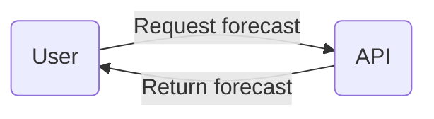
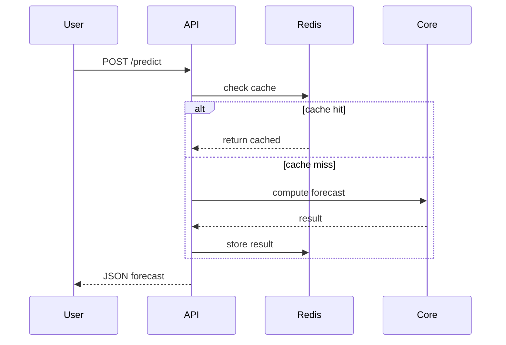

# Cryptocast

**Микросервис для прогноза криптовалют**

## Описание

**Проект позволяет пользователю выбрать криптовалюту (XRP, BTC, ETH и др.) и 
получить прогноз ее цены на заданное количество дней.
Прогноз строится с использованием модели Prophet.**

## Установка

### Через TestPyPI:

```bash
pip install --index-url https://test.pypi.org/simple/ cryptocast
```

## Use-case диаграмма


## Sequence диаграмма


